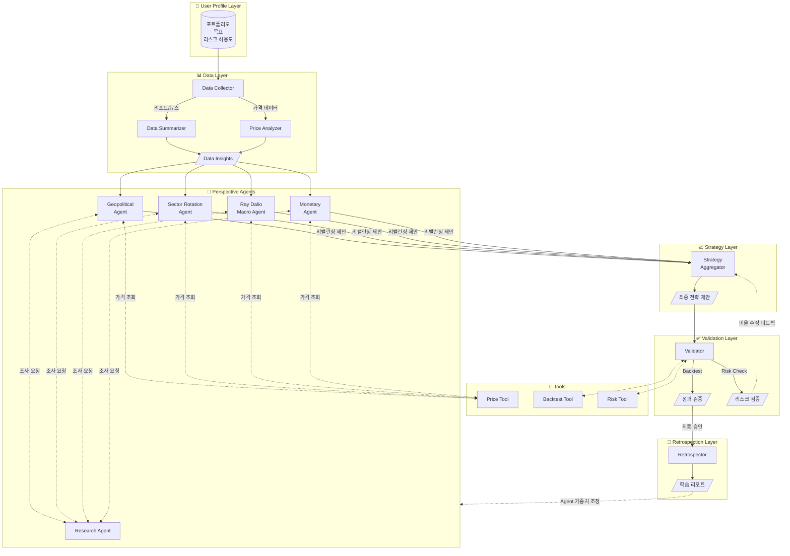

# MARA: Macro Asset Rebalance Agent

AI 기반 거시 경제 분석 및 개인 맞춤형 동적 포트폴리오 최적화 시스템

## 🚀 Key Features

- **6-Layer Agent Pipeline**: User Profile → Data → Perspective Agents (병렬) → Strategy → Validation → Retrospection
- **Perspective-Based Parallel Analysis**: 지정학, 섹터, 매크로, 금리 등 다양한 관점의 Agent가 병렬로 분석
- **Multi-Hop Agent Communication**: Perspective Agent ↔ Research Agent 간 반복 소통 (최대 3회)으로 심층 분석
- **Tool-Based Integration**: Price, Portfolio, Backtest 등 기능은 Tool로 분리하여 재사용성 확보
- **User-Defined Risk Metrics**: MDD, Volatility, VaR 등 사용자가 직접 리스크 허용도 정의
- **Investment Goals**: 공격(Aggressive), 균형(Balanced), 안정(Defensive) 목표 선택
- **Validation Loop**: Strategy ↔ Validation 간 피드백 루프 (최대 3회) 로 리스크 조건 충족까지 반복 조정
- **Self-Learning System**: Retrospection Layer에서 예측 vs 실제 비교 → Agent 가중치 자동 조정 제안
- **Interactive Visualization**: Timeline & Detail View로 전체 분석 과정 시각화

## 🏗 System Architecture

본 프로젝트는 LangGraph를 활용하여 에이전트 간의 상태(State)를 관리하고 순환 구조를 구현합니다.

### Layer Overview

| Layer | 역할 |
|-------|------|
| **User Profile Layer** | 현재 포트폴리오, 투자 목표(공격/균형/안정), 리스크 허용도 정의 |
| **Data Layer** | 뉴스, 리포트 수집 및 요약 / 가격 변동 분석 |
| **Perspective Agents** | 다양한 관점(지정학, 섹터, 매크로 등)에서 병렬 분석 및 리밸런싱 제안 |
| **Strategy Layer** | 여러 Agent 제안을 종합하여 최종 포트폴리오 조정 방향 제시 |
| **Validation Layer** | Backtest, 리스크 측정으로 목표 조건 충족 여부 검증 |
| **Retrospection Layer** | 시간 경과 후 예측 vs 실제 비교, 논리적 검증 |

### Tools

Agent가 LangGraph Tool로 호출하는 기능들 (`src/tools/`):

| Tool | 기능 | 위치 |
|------|------|------|
| **Price Tool** | 종목의 현재가, 과거 가격, 수익률 조회 | `src/tools/market/price.py` |
| **Portfolio Loader** | ETF/펀드 구성 종목 조회 | `src/tools/market/portfolio.py` |
| **Backtest Tool** | 포트폴리오 과거 성과 시뮬레이션 | `src/tools/analysis/backtest.py` |
| **Risk Tool** | MDD, VaR, Volatility, Beta 계산 | `src/tools/analysis/risk.py` |

> **Note**: 뉴스/리포트 수집은 Tool이 아닌 Data Layer(`src/data/collectors/`)에서 처리

### Risk Metrics

사용자가 정의할 수 있는 리스크 지표:

| 지표 | 설명 | 예시 |
|------|------|------|
| **Maximum Drawdown (MDD)** | 고점 대비 최대 하락폭 (권장) | "20% 이상 빠지면 안 된다" |
| **Volatility** | 수익률의 표준편차 | "연간 변동성 15% 이내" |
| **Value at Risk (VaR)** | 95% 신뢰구간 최대 손실 | "월 VaR 5% 이내" |
| **Beta** | 시장 대비 민감도 | "Beta 0.8 이하로 방어적" |


### Agent Flow (Mermaid)



### Flow 설명

1. **User Profile Layer**: 사용자가 현재 포트폴리오, 투자 목표(공격/균형/안정), 감당 가능한 리스크(MDD, Volatility 등)를 정의합니다.

2. **Data Layer**: 외부 소스에서 데이터를 수집합니다.
   - **Data Collector**: 뉴스(RSS/웹 스크래핑), 리포트(공개 PDF) 수집
   - **Data Summarizer**: LLM 기반 텍스트 요약, 핵심 인사이트 추출
   - **Price Analyzer**: yfinance 기반 가격 변동 추이, 기술적 지표 분석

3. **Perspective Agents**: Data Layer의 인사이트를 기반으로 **여러 관점의 Agent가 병렬로 분기**됩니다.
   - 각 Agent는 자신의 관점(지정학, 섹터, 매크로, 금리)에서 현재 포트폴리오를 평가
   - **Research Agent와 multi-hop 소통** (최대 3회)하여 새로운 섹터/테마 발굴
     - **종료 조건**: 충분한 정보 확보 시 조기 종료 / 3회 도달 시 현재까지 수집된 정보로 진행
     - **실패 처리**: Research Agent 응답 실패 시 해당 Perspective Agent는 자체 분석으로 fallback
   - **Price Tool**을 통해 시장 가격 정보 조회
   - 각 Agent가 독립적으로 **리밸런싱 제안**까지 수행

4. **Strategy Layer**: 여러 Perspective Agent의 제안을 종합합니다.
   - 각 Agent의 신뢰도(과거 성과 기반)를 가중치로 활용
   - 최종 포트폴리오 조정 방향 제시

5. **Validation Layer**: 제안된 전략을 검증합니다.
   - **Backtest**: 과거 데이터로 성과 시뮬레이션
   - **Risk Check**: 사용자가 정의한 리스크 조건(MDD, VaR 등) 충족 여부 확인
   - 조건 미충족 시 → Strategy Layer에 **비율 수정 피드백** 전달 (최대 3회 반복)
   - **Loop 종료 조건**:
     - ✅ 성공: 모든 리스크 조건 충족
     - ⚠️ 부분 승인: 3회 반복 후에도 일부 조건 미충족 시, 위반 사항을 명시하고 사용자 확인 요청
     - ❌ 거부: 핵심 리스크 조건(MDD) 위반 시 포트폴리오 제안 불가, 보수적 대안 제시

6. **Retrospection Layer**: 시간이 지난 후 평가합니다.
   - 예측 vs 실제 성과 비교
   - 어떤 논리가 맞았고 틀렸는지 분석
   - Agent 가중치 조정 제안 → 다음 사이클에 반영

### State Management (LangGraph)

각 Layer는 공유 State를 읽고 쓰며, 다음 정보를 전달합니다:

- **UserProfileState**: 포트폴리오, 투자 목표, 리스크 허용도
- **DataState**: 시장 데이터 요약, 가격 변동, 핵심 인사이트
- **PerspectiveState**: 각 Agent별 평가 및 리밸런싱 제안
- **StrategyState**: 종합된 포트폴리오 조정 방향, 최종 비중
- **ValidationState**: 백테스팅 결과, 리스크 메트릭, 승인/거부
- **RetrospectionState**: 예측 vs 실제, 학습 인사이트, Agent 가중치 조정

### Output Schemas (Pydantic)

각 Layer의 출력 형식을 명확히 정의합니다:

```python
from pydantic import BaseModel, Field
from typing import Literal
from datetime import datetime

# Perspective Agent → Strategy Layer
class RebalanceProposal(BaseModel):
    """개별 Perspective Agent의 리밸런싱 제안"""
    agent_id: str                                    # e.g., "ray_dalio_macro"
    ticker: str                                      # e.g., "XLK"
    action: Literal["BUY", "SELL", "HOLD"]
    current_weight: float = Field(ge=0, le=1)        # 현재 비중
    target_weight: float = Field(ge=0, le=1)         # 제안 비중
    confidence: float = Field(ge=0, le=1)            # 확신도
    rationale: str                                   # 근거 설명
    supporting_data: list[str]                       # 참조한 데이터 소스

class PerspectiveOutput(BaseModel):
    """Perspective Agent 전체 출력"""
    agent_id: str
    timestamp: datetime
    market_outlook: Literal["BULLISH", "NEUTRAL", "BEARISH"]
    proposals: list[RebalanceProposal]
    risk_assessment: str
    research_queries: list[str]                      # Research Agent에 요청한 쿼리들

# Strategy Layer → Validation Layer
class PortfolioAllocation(BaseModel):
    """최종 포트폴리오 배분"""
    ticker: str
    weight: float = Field(ge=0, le=1)
    rationale: str

class StrategyOutput(BaseModel):
    """Strategy Layer 출력"""
    timestamp: datetime
    allocations: list[PortfolioAllocation]
    total_weight: float = Field(eq=1.0)              # 합계 100%
    dominant_perspective: str                        # 가장 영향력 있던 Agent
    dissenting_views: list[str]                      # 반대 의견 요약

# Validation Layer → Final Output / Strategy Feedback
class ValidationResult(BaseModel):
    """Validation Layer 출력"""
    is_approved: bool
    iteration: int = Field(ge=1, le=3)
    risk_metrics: dict[str, float]                   # {"mdd": 0.18, "volatility": 0.12, ...}
    violations: list[str]                            # 위반된 조건들
    feedback: str | None                             # Strategy Layer로 보낼 피드백 (미승인 시)
    backtest_summary: dict                           # {"sharpe": 1.2, "cagr": 0.08, ...}
```

## 📂 Project Structure

```
mara/
├── src/
│   ├── core/                    # 핵심 도메인
│   │   ├── state.py             # LangGraph State 정의 (6개 State 클래스)
│   │   ├── models.py            # 도메인 모델 (Pydantic)
│   │   ├── profile.py           # User Profile 로더 (YAML → UserProfileState)
│   │   └── exceptions.py        # 커스텀 예외
│   │
│   ├── data/                    # Data Layer - 데이터 수집 및 분석
│   │   ├── collectors/          # 데이터 수집기
│   │   │   ├── news.py          # 뉴스 수집 (RSS, 웹 스크래핑)
│   │   │   └── report.py        # 전문가 리포트 수집
│   │   ├── analyzers/           # 데이터 분석기
│   │   │   ├── price.py         # 가격 변동 분석
│   │   │   └── sentiment.py     # 감성 분석
│   │   └── summarizer.py        # 텍스트 요약 (LLM 기반)
│   │
│   ├── tools/                   # LangGraph Tools (Agent가 호출하는 도구)
│   │   ├── market/              # 시장 데이터 도구
│   │   │   ├── price.py         # 가격 조회 Tool
│   │   │   └── portfolio.py     # 포트폴리오 로더 Tool
│   │   └── analysis/            # 분석 도구
│   │       ├── backtest.py      # 백테스팅 Tool
│   │       └── risk.py          # 리스크 계산 Tool (MDD, VaR, Beta)
│   │
│   ├── agents/                  # Agent Layers
│   │   ├── perspective/         # Perspective Agents (Persona 기반 동적 생성)
│   │   │   ├── base.py          # BasePerspectiveAgent 추상 클래스
│   │   │   └── factory.py       # Persona YAML → Agent 인스턴스 생성
│   │   ├── research/            # Research Agent - 신규 섹터/테마 발굴
│   │   │   └── agent.py         # 웹 검색, 심층 조사 수행
│   │   ├── strategy/            # Strategy Layer - 최종 전략 종합
│   │   │   ├── aggregator.py    # 다중 Agent 제안 종합
│   │   │   └── optimizer.py     # cvxpy 기반 포트폴리오 최적화
│   │   ├── validation/          # Validation Layer - 백테스트/리스크 검증
│   │   │   └── validator.py     # 리스크 조건 검증, 피드백 생성
│   │   └── retrospection/       # Retrospection Layer - 성과 분석 및 학습
│   │       └── evaluator.py     # 예측 vs 실제 비교, 가중치 조정 제안
│   │
│   ├── orchestration/           # LangGraph 워크플로우 관리
│   │   ├── graph.py             # 메인 그래프 정의
│   │   ├── nodes.py             # 노드 함수들
│   │   └── cli.py               # CLI 엔트리포인트
│   │
│   ├── db/                      # 데이터베이스 (SQLite)
│   │   ├── models.py            # SQLAlchemy 모델 (predictions, evaluations, personas)
│   │   ├── repository.py        # 데이터 접근 계층
│   │   └── migrations/          # Alembic 마이그레이션
│   │
│   ├── utils/                   # 공통 유틸리티
│   │   ├── llm.py               # LLM 클라이언트 (Anthropic)
│   │   ├── cache.py             # 캐싱 유틸리티
│   │   └── logging.py           # 로깅 설정
│   │
│   └── config/                  # YAML 설정 파일
│       ├── flows/               # 워크플로우 설정
│       │   ├── growth.yaml      # 공격적 투자자 Flow
│       │   └── income.yaml      # 안정 수익 투자자 Flow
│       ├── personas/            # Agent 페르소나 정의
│       │   ├── ray_dalio_macro.yaml
│       │   ├── warren_buffett_value.yaml
│       │   ├── geopolitical.yaml
│       │   └── sector_rotation.yaml
│       ├── profiles/            # 사용자 투자 프로필
│       └── ensemble_weights.yaml # Agent 간 가중치
│
├── data/                        # 로컬 데이터 저장소
│   ├── raw/                     # 원본 데이터 (API 응답)
│   ├── processed/               # 전처리된 데이터
│   └── cache/                   # 캐시 데이터 (SQLite/Redis)
│
├── outputs/                     # 출력 결과물
│   ├── reports/                 # 포트폴리오 리포트 (Markdown)
│   ├── portfolios/              # 포트폴리오 정의 (JSON)
│   ├── visualizations/          # 시각화 결과 (HTML)
│   └── logs/                    # 실행 로그
│
├── tests/                       # 테스트 코드
│   ├── unit/                    # 단위 테스트
│   ├── integration/             # 통합 테스트
│   └── fixtures/                # 테스트 데이터
│
└── docs/                        # 문서
    ├── SYSTEM_SUMMARY.md        # 전체 시스템 요약
    ├── FLOW_DEFINITIONS.md      # Flow 상세 정의
    ├── AGENT_TRACKING.md        # Agent 추적 및 평가
    ├── VISUALIZATION_GUIDE.md   # 시각화 가이드
    └── QUICKSTART.md            # 빠른 시작 가이드
```

### 구조 설계 원칙

| 원칙 | 적용 |
|------|------|
| **Layer 분리** | `data/` → `agents/` → `orchestration/` 순서로 의존성 흐름 |
| **Persona 기반 확장** | `perspective/factory.py`가 YAML에서 Agent 동적 생성 |
| **도구-에이전트 분리** | `tools/`는 순수 함수, `agents/`는 LLM 호출 로직 |
| **State 중심 설계** | `core/state.py`에 모든 State 클래스 정의, 단일 진실 공급원 |

## 🚦 Quick Start

### 요구 사항

- Python 3.11+ (< 3.13)
- [uv](https://docs.astral.sh/uv/) (권장) 또는 pip

### 1. 설치

```bash
# uv 사용 (권장)
uv venv && source .venv/bin/activate
uv pip install -e ".[dev]"

# 또는 pip 사용
python -m venv .venv && source .venv/bin/activate
pip install -e ".[dev]"
```

### 2. 환경 변수 설정

```bash
cp .env.example .env
```

`.env` 파일을 편집하여 필수 API 키를 설정합니다:

```bash
# 필수
ANTHROPIC_API_KEY=sk-ant-your-api-key-here

# 선택 (추가 데이터 소스)
ALPHA_VANTAGE_API_KEY=your-api-key-here
FRED_API_KEY=your-api-key-here
```

### 3. 기본 실행

```bash
# Growth 프로필로 전체 워크플로우 실행
mara run --profile growth

# Income 프로필로 실행
mara run --profile income

# 또는 모듈 직접 실행
python -m src.orchestration.cli run --profile growth
```

### 4. 추가 명령어

```bash
# 월간 성과 회고 (Retrospection)
mara retrospect --prediction-id 2025-01-15-growth

# 포트폴리오 백테스팅
mara backtest --allocation '{"XLK": 0.3, "XLV": 0.2}' --start-date 2015-01-01

# 도움말
mara --help
```

### 5. 출력 확인

```bash
# 생성된 리포트 확인
cat outputs/reports/latest_growth_portfolio.md

# 포트폴리오 JSON 확인
cat outputs/portfolios/latest_growth_portfolio.json

# 시각화 확인 (브라우저에서 열기)
open outputs/visualizations/latest_timeline.html
```

더 자세한 사용법은 [Quick Start Guide](docs/QUICKSTART.md)를 참고하세요.

## ⚡ Error Handling & Resilience

### 재시도 정책

| 컴포넌트 | 재시도 횟수 | 백오프 전략 | Timeout |
|----------|-------------|-------------|---------|
| **LLM API (Anthropic)** | 3회 | Exponential (1s, 2s, 4s) | 60s |
| **Market Data (yfinance)** | 2회 | Linear (2s, 4s) | 30s |
| **Research Agent 웹 검색** | 2회 | Linear (1s, 2s) | 20s |

### Fallback 전략

```
┌─────────────────────────────────────────────────────────────────┐
│ 장애 상황                    │ Fallback 동작                    │
├─────────────────────────────────────────────────────────────────┤
│ LLM API 장애                 │ 캐시된 최근 분석 결과 사용        │
│                              │ (24시간 이내), 없으면 작업 중단   │
├─────────────────────────────────────────────────────────────────┤
│ Market Data 장애             │ 캐시된 가격 데이터 사용 (1시간    │
│                              │ 이내), stale 데이터 경고 표시     │
├─────────────────────────────────────────────────────────────────┤
│ Research Agent 실패          │ Perspective Agent가 자체 분석     │
│                              │ 으로 진행 (research_failed 플래그)│
├─────────────────────────────────────────────────────────────────┤
│ 개별 Perspective Agent 실패  │ 해당 Agent 제외하고 나머지로 종합 │
│                              │ (최소 2개 Agent 필요, 미만 시 중단)│
├─────────────────────────────────────────────────────────────────┤
│ Validation Backtest 실패     │ 리스크 메트릭만으로 검증 진행     │
│                              │ (backtest_skipped 경고 표시)      │
└─────────────────────────────────────────────────────────────────┘
```

### Rate Limiting

| API | 제한 | 대응 |
|-----|------|------|
| **Anthropic Claude** | 분당 요청 제한 | Token bucket으로 요청 속도 조절 |
| **yfinance** | 비공식 제한 존재 | 요청 간 0.5초 딜레이, 일일 캐싱 |
| **FRED** | 분당 120회 | Rate limiter 적용 |

### 예외 계층 구조

```python
# src/core/exceptions.py
class MARAException(Exception):
    """Base exception for MARA"""

class DataFetchError(MARAException):
    """데이터 수집 실패"""

class LLMResponseError(MARAException):
    """LLM 응답 파싱/검증 실패"""

class ValidationError(MARAException):
    """리스크 검증 실패 (3회 반복 후에도 미충족)"""

class AgentTimeoutError(MARAException):
    """Agent 실행 시간 초과"""

class InsufficientAgentsError(MARAException):
    """최소 Agent 수(2개) 미달"""
```

## 🔧 Tech Stack

| 카테고리 | 기술 | 용도 |
|----------|------|------|
| **Orchestration** | LangGraph, LangChain | 멀티 에이전트 워크플로우, State 관리 |
| **LLM** | Claude Opus 4.5 (Anthropic) | 금융 분석 reasoning, 텍스트 요약 |
| **Data Sources** | yfinance, pandas-datareader (FRED) | 시장 데이터, 거시경제 지표 |
| **Optimization** | cvxpy | Mean-Variance 포트폴리오 최적화 |
| **Analysis** | pandas, numpy, scipy | 금융 데이터 처리, 통계 분석 |
| **Visualization** | plotly, matplotlib, seaborn | 인터랙티브 차트, 통계적 시각화 |
| **Database** | SQLAlchemy, Alembic, SQLite | ORM, 마이그레이션, 로컬 저장소 |
| **Validation** | Pydantic | State/Model 스키마 검증 |
| **CLI** | Click, Rich | 명령줄 인터페이스, 터미널 UX |
| **Configuration** | PyYAML | Persona, Flow, Profile 설정 |
| **Logging** | Loguru | 구조화된 로깅 |
| **Caching** | SQLite / Redis (optional) | API 응답 캐싱 |

## 📝 License

MIT License

## 🤝 Contributing

이슈 및 Pull Request를 환영합니다!

## ⚠️ Disclaimer

본 프로젝트는 교육 및 연구 목적으로 개발되었습니다. 실제 투자 결정은 개인의 책임 하에 이루어져야 하며, 본 시스템의 제안은 참고용으로만 활용하시기 바랍니다.
