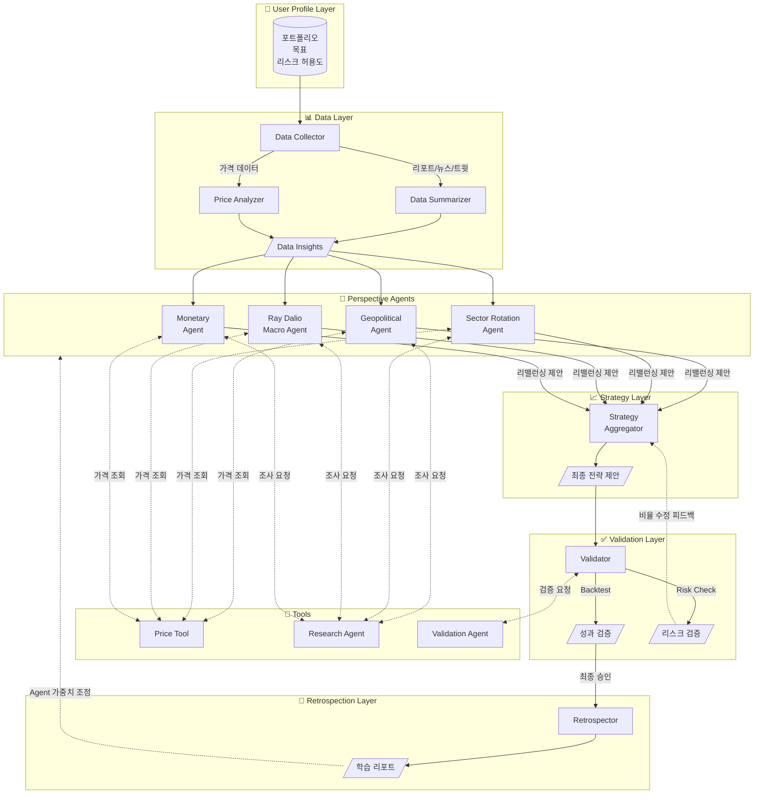

# MARA: Macro Asset Rebalance Agent

AI 기반 거시 경제 분석 및 개인 맞춤형 동적 포트폴리오 최적화 시스템

## 🚀 Key Features

- **5-Layer Agent Architecture**: User Profile → Data → Perspective Agents (병렬) → Strategy → Validation → Retrospection
- **Perspective-Based Parallel Analysis**: 지정학, 섹터, 매크로, 금리 등 다양한 관점의 Agent가 병렬로 분석
- **Multi-Hop Agent Communication**: Perspective Agent ↔ Research Agent 간 반복적 소통으로 심층 분석
- **Tool-Based Integration**: Price, Portfolio, Backtest 등 기능은 Tool로 분리하여 재사용성 확보
- **User-Defined Risk Metrics**: MDD, Volatility, VaR 등 사용자가 직접 리스크 허용도 정의
- **Investment Goals**: 공격(Aggressive), 균형(Balanced), 안정(Defensive) 목표 선택
- **Validation Loop**: Strategy ↔ Validation 간 피드백 루프로 리스크 조건 충족까지 반복 조정
- **Self-Learning System**: Retrospection Layer에서 예측 vs 실제 비교 → Agent 가중치 자동 조정 제안
- **Interactive Visualization**: Timeline & Detail View로 전체 분석 과정 시각화

## 🏗 System Architecture

본 프로젝트는 LangGraph를 활용하여 에이전트 간의 상태(State)를 관리하고 순환 구조를 구현합니다.

### Layer Overview

| Layer | 역할 |
|-------|------|
| **User Profile Layer** | 현재 포트폴리오, 투자 목표(공격/균형/안정), 리스크 허용도 정의 |
| **Data Layer** | 리포트, 뉴스, 트윗 수집 및 요약 / 가격 변동 분석 |
| **Perspective Agents** | 다양한 관점(지정학, 섹터, 매크로 등)에서 병렬 분석 및 리밸런싱 제안 |
| **Strategy Layer** | 여러 Agent 제안을 종합하여 최종 포트폴리오 조정 방향 제시 |
| **Validation Layer** | Backtest, 리스크 측정으로 목표 조건 충족 여부 검증 |
| **Retrospection Layer** | 시간 경과 후 예측 vs 실제 비교, 논리적 검증 |

### Tools

Agent가 아닌 **도구(Tool)** 로 분리된 기능들:

| Tool | 기능 |
|------|------|
| **Price Tool** | 특정 종목의 현재가, 과거 가격, 수익률 조회 |
| **Portfolio Loader** | 특정 기관/펀드의 포트폴리오 다운로드 |
| **News Fetcher** | 최신 뉴스 및 트윗 수집 |
| **Report Fetcher** | 전문가 리포트 수집 |
| **Backtest Tool** | 포트폴리오 백테스팅 수행 |

### Risk Metrics

사용자가 정의할 수 있는 리스크 지표:

| 지표 | 설명 | 예시 |
|------|------|------|
| **Maximum Drawdown (MDD)** | 고점 대비 최대 하락폭 (권장) | "20% 이상 빠지면 안 된다" |
| **Volatility** | 수익률의 표준편차 | "연간 변동성 15% 이내" |
| **Value at Risk (VaR)** | 95% 신뢰구간 최대 손실 | "월 VaR 5% 이내" |
| **Beta** | 시장 대비 민감도 | "Beta 0.8 이하로 방어적" |


### Agent Flow (Mermaid)



### Flow 설명

1. **User Profile Layer**: 사용자가 현재 포트폴리오, 투자 목표(공격/균형/안정), 감당 가능한 리스크(MDD, Volatility 등)를 정의합니다.

2. **Data Layer**: 외부 소스에서 데이터를 수집합니다.
   - **Data Collector**: 리포트, 뉴스, 트윗을 수집
   - **Data Summarizer**: 수집된 텍스트 데이터를 요약하여 핵심 인사이트 추출
   - **Price Analyzer**: 가격 변동 추이, 주요 지표 변화 분석

3. **Perspective Agents**: Data Layer의 인사이트를 기반으로 **여러 관점의 Agent가 병렬로 분기**됩니다.
   - 각 Agent는 자신의 관점(지정학, 섹터, 매크로, 금리)에서 현재 포트폴리오를 평가
   - **Research Agent와 multi-hop 소통**하여 새로운 섹터/테마 발굴
   - **Price Tool**을 통해 실시간 가격 정보 조회
   - 각 Agent가 독립적으로 **리밸런싱 제안**까지 수행

4. **Strategy Layer**: 여러 Perspective Agent의 제안을 종합합니다.
   - 각 Agent의 신뢰도(과거 성과 기반)를 가중치로 활용
   - 최종 포트폴리오 조정 방향 제시

5. **Validation Layer**: 제안된 전략을 검증합니다.
   - **Backtest**: 과거 데이터로 성과 시뮬레이션
   - **Risk Check**: 사용자가 정의한 리스크 조건(MDD, VaR 등) 충족 여부 확인
   - 조건 미충족 시 → Strategy Layer에 **비율 수정 피드백** 전달

6. **Retrospection Layer**: 시간이 지난 후 평가합니다.
   - 예측 vs 실제 성과 비교
   - 어떤 논리가 맞았고 틀렸는지 분석
   - Agent 가중치 조정 제안 → 다음 사이클에 반영

### State Management (LangGraph)

각 Layer는 공유 State를 읽고 쓰며, 다음 정보를 전달합니다:

- **UserProfileState**: 포트폴리오, 투자 목표, 리스크 허용도
- **DataState**: 시장 데이터 요약, 가격 변동, 핵심 인사이트
- **PerspectiveState**: 각 Agent별 평가 및 리밸런싱 제안
- **StrategyState**: 종합된 포트폴리오 조정 방향, 최종 비중
- **ValidationState**: 백테스팅 결과, 리스크 메트릭, 승인/거부
- **RetrospectionState**: 예측 vs 실제, 학습 인사이트, Agent 가중치 조정

## 📂 Project Structure

```
mara/
├── src/
│   ├── data/              # Data Layer - 데이터 수집, 요약, 가격 분석
│   ├── tools/             # Tools - Agent가 사용하는 도구들
│   │   ├── price/         # Price Tool - 가격 조회
│   │   ├── portfolio/     # Portfolio Loader - 포트폴리오 다운로드
│   │   ├── news/          # News Fetcher - 뉴스/트윗 수집
│   │   ├── report/        # Report Fetcher - 리포트 수집
│   │   └── backtest/      # Backtest Tool - 백테스팅
│   ├── agents/            # Agent Layers
│   │   ├── perspective/   # Perspective Agents (지정학, 섹터, 매크로, 금리)
│   │   ├── research/      # Research Agent - 신규 섹터/테마 발굴
│   │   ├── strategy/      # Strategy Layer - 최종 전략 종합
│   │   ├── validation/    # Validation Layer - 백테스트/리스크 검증
│   │   └── retrospection/ # Retrospection Layer - 성과 분석 및 학습
│   ├── orchestration/     # LangGraph 워크플로우 관리
│   ├── utils/             # 공통 유틸리티 함수
│   └── config/            # YAML 설정 파일
├── data/                  # 로컬 데이터 저장소
│   ├── raw/               # 원본 데이터
│   ├── processed/         # 전처리된 데이터
│   └── cache/             # 캐시 데이터
├── outputs/               # 출력 결과물
│   ├── reports/           # 포트폴리오 리포트 (Markdown)
│   ├── portfolios/        # 포트폴리오 정의 (JSON)
│   └── logs/              # 실행 로그
├── tests/                 # 테스트 코드
└── docs/                  # 문서
    ├── ARCHITECTURE.md    # 시스템 아키텍처 상세
    └── QUICKSTART.md      # 빠른 시작 가이드
```

각 폴더에는 상세한 설명이 담긴 `README.md`가 포함되어 있습니다.

## 🚦 Quick Start

### 1. 설치

```bash
# 의존성 설치
pip install -r requirements.txt

# 환경 변수 설정
cp .env.example .env
# .env 파일에 ANTHROPIC_API_KEY 입력
```

### 2. 기본 실행

```bash
# Growth 프로필로 전체 워크플로우 실행
python -m src.orchestration.cli run --profile growth

# Income 프로필로 실행
python -m src.orchestration.cli run --profile income
```

### 3. 출력 확인

```bash
# 생성된 리포트 확인
cat outputs/reports/latest_growth_portfolio.md

# 포트폴리오 JSON 확인
cat outputs/portfolios/latest_growth_portfolio.json
```

더 자세한 사용법은 [Quick Start Guide](docs/QUICKSTART.md)를 참고하세요.

## 🎯 Use Cases

### 1. 월별 포트폴리오 리밸런싱
매월 15일 실행하여 최신 거시 경제 상황을 반영한 포트폴리오 제안을 받습니다.

### 2. 투자 전략 백테스팅
제안된 포트폴리오를 과거 10년 데이터로 시뮬레이션하여 예상 성과를 확인합니다.

### 3. 리스크 관리
현재 포트폴리오의 Max Drawdown, VaR 등을 계산하여 리스크를 모니터링합니다.

### 4. 성과 회고
매달 예측 vs 실제 성과를 비교하여 시스템을 개선합니다.

## 🛠 Customization

### 투자 프로필 커스터마이징

[src/config/profiles/](src/config/profiles/)에서 프로필을 수정하거나 새로 생성할 수 있습니다.

```yaml
# src/config/profiles/my_profile.yaml
profile_name: my_profile
risk_tolerance: medium
constraints:
  max_drawdown_tolerance: 0.25
  min_cash_ratio: 0.10
```

### Agent 페르소나 수정

[src/config/personas/](src/config/personas/)에서 각 Agent의 분석 관점을 조정할 수 있습니다.

```yaml
# src/config/personas/geopolitical.yaml
sensitivity: conservative  # conservative, moderate, aggressive
```

### Ensemble 가중치 조정

[src/config/ensemble_weights.yaml](src/config/ensemble_weights.yaml)에서 Agent 간 가중치를 조정할 수 있습니다.

```yaml
macro_ensemble:
  default:
    geopolitical_agent: 0.30
    sector_rotation_agent: 0.40
    monetary_agent: 0.30
```

## 📚 Documentation

### 📖 읽는 순서

1. **[System Summary](docs/SYSTEM_SUMMARY.md)** ⭐ - 전체 시스템 요약 (처음 읽기)
2. **[Flow Definitions](docs/FLOW_DEFINITIONS.md)** - Growth vs Income Flow
3. **[Agent Tracking](docs/AGENT_TRACKING.md)** - Agent별 추적 및 성과 평가
4. **[Visualization Guide](docs/VISUALIZATION_GUIDE.md)** - 시각화 결과 확인
5. **[Quick Start](docs/QUICKSTART.md)** - 설치 및 실행

### Core Documentation
- [System Summary](docs/SYSTEM_SUMMARY.md) - 전체 시스템 설계 요약
- [Flow Definitions](docs/FLOW_DEFINITIONS.md) - Growth vs Income Flow 상세
- [State Persistence](docs/STATE_PERSISTENCE.md) - DB 스키마 및 데이터 영속성
- [Agent Tracking](docs/AGENT_TRACKING.md) - Agent별 예측 저장 및 성과 평가
- [Visualization Guide](docs/VISUALIZATION_GUIDE.md) - Timeline & Detail View 가이드
- [Quick Start](docs/QUICKSTART.md) - 빠른 시작 가이드
- [UV Setup](docs/UV_SETUP.md) - Python 환경 관리

### Layer Documentation
- [Data Layer](src/data/README.md) - 데이터 수집, 요약, 가격 분석
- [Perspective Agents](src/agents/perspective/README.md) - 다양한 관점의 병렬 분석
- [Research Agent](src/agents/research/README.md) - 신규 섹터/테마 발굴
- [Strategy Layer](src/agents/strategy/README.md) - 최종 전략 종합
- [Validation Layer](src/agents/validation/README.md) - 백테스팅 및 리스크 검증
- [Retrospection Layer](src/agents/retrospection/README.md) - 성과 분석 및 자가 학습

### Tools Documentation
- [Price Tool](src/tools/price/README.md) - 가격 조회
- [Backtest Tool](src/tools/backtest/README.md) - 백테스팅 수행

### Configuration
- **Flow 설정**: [Growth](src/config/flows/growth.yaml) | [Income](src/config/flows/income.yaml)
- **Persona 설정**: [Ray Dalio](src/config/personas/ray_dalio_macro.yaml) | [Warren Buffett](src/config/personas/warren_buffett_value.yaml)

### Sample Outputs
- **데이터**: [Prediction](outputs/data/marv_2025-01-17_full.json) | [Evaluation](outputs/data/marv_2025-01-17_evaluation.json)
- **시각화**: [Timeline](outputs/visualizations/marv_timeline.html) | [Detail](outputs/visualizations/marv_2025-01-17_detail.html)

## 🔧 Tech Stack

- **Orchestration**: LangGraph
- **LLM**: Claude Opus 4.5 (Anthropic)
- **Data Sources**: MCP Tools, Yahoo Finance, FRED
- **Optimization**: cvxpy (Mean-Variance Optimization)
- **Analysis**: pandas, numpy, scipy
- **Visualization**: matplotlib, plotly
- **Configuration**: YAML
- **Caching**: SQLite / Redis

## 📝 License

MIT License

## 🤝 Contributing

이슈 및 Pull Request를 환영합니다!

## ⚠️ Disclaimer

본 프로젝트는 교육 및 연구 목적으로 개발되었습니다. 실제 투자 결정은 개인의 책임 하에 이루어져야 하며, 본 시스템의 제안은 참고용으로만 활용하시기 바랍니다.
